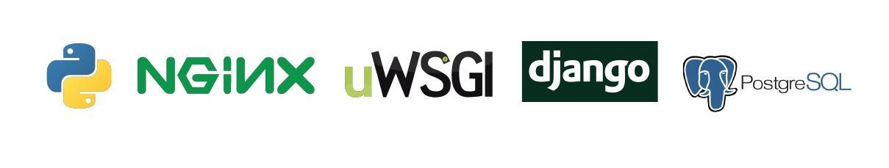
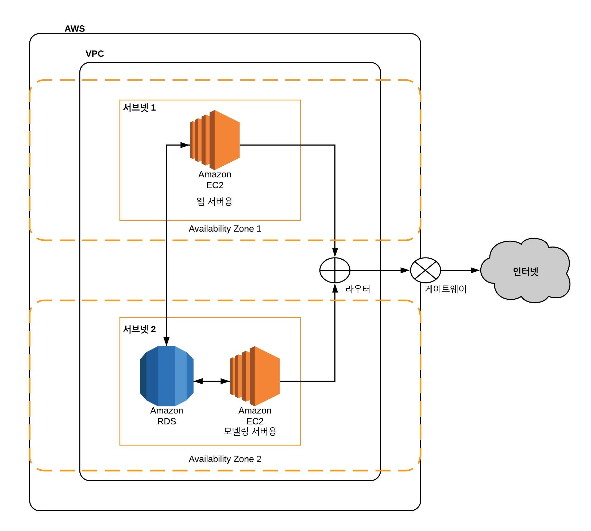
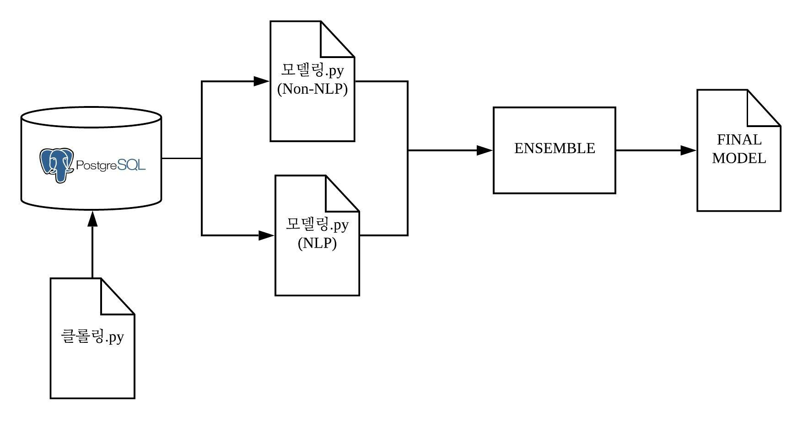
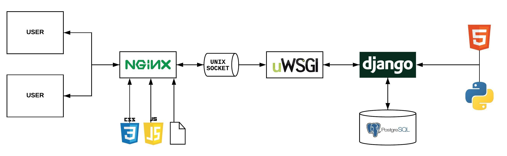

Project Tellus
================

### TEAM 11대0

데이터공학 프로젝트

> 목차

1.  Kickstater란?
2.  프로젝트에 사용된 기술
3.  [시스템 아키텍쳐]()  
4.  [서버 구성]()
      - [AWS Ubuntu EC2 와 Python Django](documentation/python_django.md)
      - [uWSGI, Nginx, AWS EC2 사용하여 Django
        배포](documentation/uwsgi_nginx.md)
5.  [데이터 전처리]()  
6.  [모델링 구성]()

## Kickstarter

Kickstarter는 투자자와 아이디어를 가진 창업자 또는 스타트업을 연결하는 소셜 펀딩 플랫폼이다. 인터넷을 통해 한 명 또는
소수의 투자자가 아닌, 수많은 사람으로부터 동시에 투자를 받을 수 있으며 투자에 성공한 아이디어 소유자는 투자한 사람들에게 약속된
보상을 제공하게 된다. Kickstarter는 이러한 소셜 펀딩 플랫폼 사이에서 가장 유명하다.

## 사용중인 기술들

 

웹을 배포하기 위에 위에와 같이 Python, NGINIX, uWSGI, Django, PostgreSQL을 사용하였다. 그리고
유저의 요청을 받아서 해당 프로젝트의 성공률을 예측하는 방법으로는 Catboost와 Scikit-learn 안에 있는 기술들을
사용하였다.

## 시스템 아키텍쳐

이번 프로젝트는 [Amazon Web Service](https://aws.amazon.com/ko/) 서비스들을 사용하였다.
 AWS EC2 를 사용하여 왭서버용과
모델들을 돌려서 학습 시키는 모델링 서버를 사용했다. 그리고 모든 데이터들은 Amazon RDS를 사용해서 관리를
하였다.

#### 모델 아키텍쳐

 머신러닝 모델을 돌리기 위해서 크롤링
코드로 받은 데이들을 데이터베이스에 저장했다. \<NLP + Non-NLP 간단히 요약\>

#### 서비스 아키텍쳐

 **Django**  
이번 프로젝트는 오픈소스이며 빠르게 개발할 수 있는 Django 웹 프레임워크를 사용했다. 많은 라이브러리를 포함하고 있고
데이터베이스 관리, URL 파싱도 등 웹 개발에 있어 다양한 면에서 안전하고 편리하다.

**uWSGI**  
파이썬 언어는 왭서버에 요청을 주고 받을 수 없어서 중간에 WSGI (Web Server Gateway Interface)가
필요하다. 여기서는 uWSGI 서버를 사용해서 웹에서 받는 요청을 WSGI 인터페이스를 통해서 파이썬 애플리케이션에
전달하고 받는 응답을 유저에게 반환할 수 있게했다.

**Nginx**  
uWSGI 서버로 HTTP 요청을 처리할 수 있지만 Nginx 왭서버를 추가하여 CSS, Javascript, 이미지 등 정적인
파일들을 처리할 수 있게했다. 동적인 요청이 있다면 그것은 UNIX socket을 통해 uWSGI 서버로 전송이 되어 처리한
후 다시 Nginx 서버로 전달받아 유저에서 결과를 반환한다. 그 외에도 Nginx 서버는 리버스 프록시를 사용하여 더
안정하고 Apache 서버와 달리 더 효율적이다.
